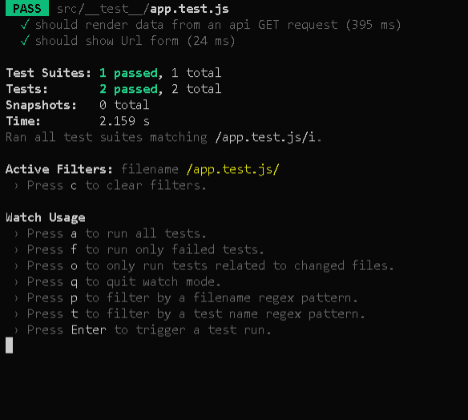

# RESTy react app - 

## Author: Rami Zaitoun

## links and resources

## 
 [sandbox deployed site](https://codesandbox.io/s/optimistic-germain-bcjkr) 

### 
 UML 

#### 
 [github link](https://github.com/MasteRminD6666/RESTy) 

#### 
 [github README.md](https://github.com/MasteRminD6666/RESTy/blob/master/README.md) 

## Setup

git clone repo from github link:
https://github.com/MasteRminD6666/RESTy.git

npm install
(to install dependencies: react, react-dom, react-scripts)

Running the app
npm run start (will run react-scripts start)

## Tests

Not required  for aLab 26 

for lab 27 

